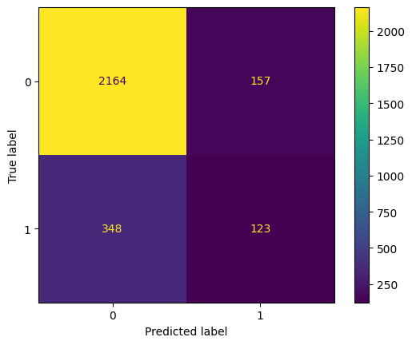
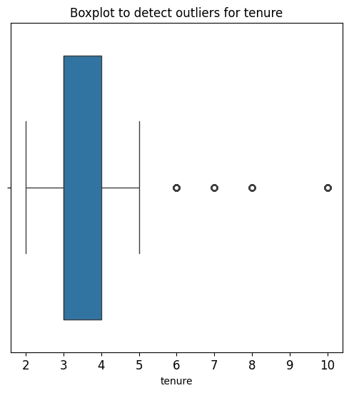
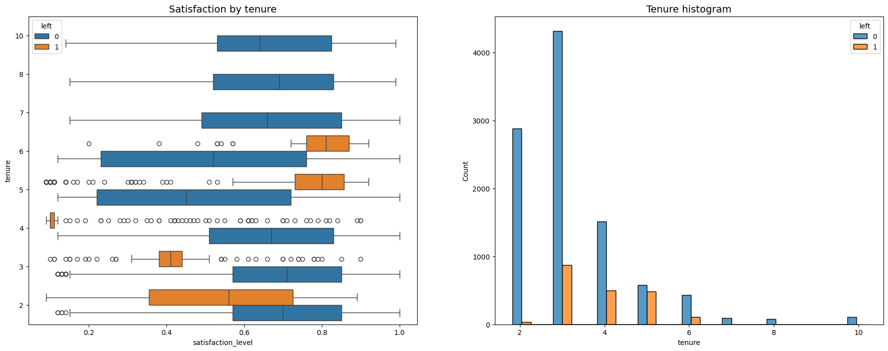
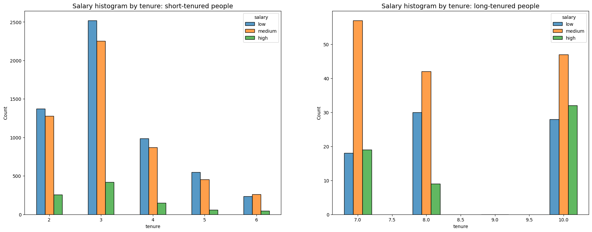
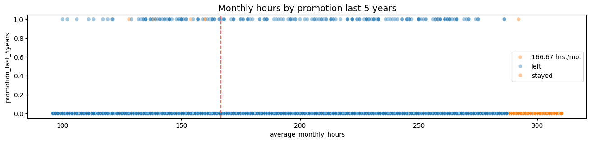
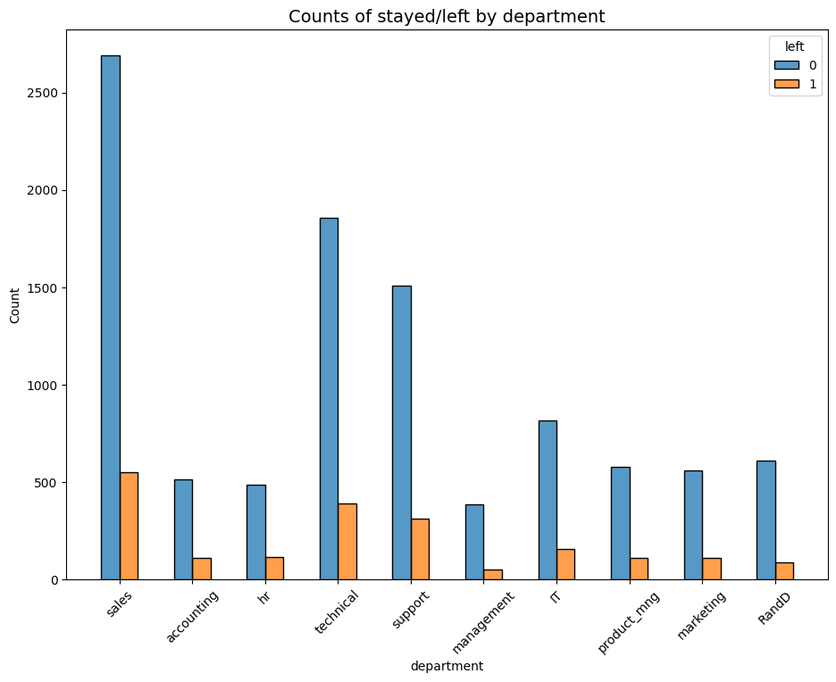
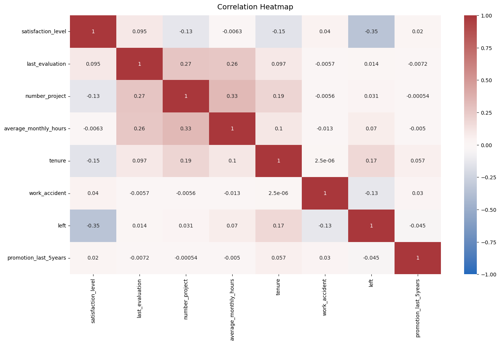

# Salifort-Motors-HR-Analytics-Project
Model to predict whether an employee will leave the company based on dataset variables 

## **Overview**
This project analyzes employee turnover at Salifort Motors, a fictional French-based alternative energy vehicle manufacturer. With a global workforce of over 100,000 employees, the company strives to support employee success and professional development. However, high turnover rates have prompted the leadership team to seek insights into the drivers of employee departure.

## **Objectives**

- Analyze employee data to uncover key factors driving turnover
- Build predictive models to forecast employee departure using:
    - Logistic Regression
    - Decision Tree
    - Random Forest
- Evaluate model performance and compare metrics to select the most effective approach.
- Provide actionable recommendations to the senior leadership team based on the findings.

## **Tools & Techniques**
- **Programming Language**: Python
- **Dev. Environment**: Google Colab
- **Libraries Used**:
  - Data Manipulation: pandas, numpy
  - Data Viz: matplotlib, seaborn
  - Machine Learning: scikit-learn
  

---

## **Dataset**
The dataset contains anonymized employee survey responses and organizational metrics such as:
- **Department**: Employee's department
- **Number of Projects**: Projects handled by the employee
- **Average Monthly Hours**:  Average working hours per month
- **Satisfaction Level**: Employee satisfaction rating
- **Last Evaluation**: Performance evaluation score
- **Work Accident**: Binary indicator of work accidents
- **Promotion in Last 5 Years**: Binary indicator of recent promotions
- **Left**: Binary target variable indicating whether an employee left the company

The data is stored in the `data/Dataset_HR_Project_Capstone.csv` file.

For more details, see the Data Dictionary provided in the repository.

## **Exploratory Data Analysis (EDA)**
Key insights from the EDA include:
- Correlation between satisfaction levels and employee departure.
- Impact of average monthly hours on turnover likelihood.
- Feature importance ranking from the Random Forest model.

Visualizations such as heatmaps, bar charts, and scatter plots were used to highlight these insights.

## **Machine Learning Models**
The project explores three models to predict employee turnover:
1. **Logistic Regression**
2. **Decision Tree**
3. **Random Forest**

These models are evaluated for their performance based on:
- **Accuracy**
- **Precision**
- **Recall**
- **F1-Score**
- **AUC-ROC Score**

The Random Forest model outperformed the Decision Tree in all evaluation metrics, demonstrating its ability to better generalize predictions on unseen data.

---

## **Key Results**

### **Logistic Regression**
Confusion Matrix: 



The upper-left quadrant displays the number of true negatives. The upper-right quadrant displays the number of false positives. The bottom-left quadrant displays the number of false negatives. The bottom-right quadrant displays the number of true positives

- **True negatives**: The number of people who did not leave that the model accurately predicted did not leave.
- **False positives**: The number of people who did not leave the model inaccurately predicted as leaving.
- **False negatives**: The number of people who left that the model inaccurately predicted did not leave.
- **True positives**: The number of people who left the model accurately predicted as leaving


Classification Report:


The classification report above shows that the logistic regression model achieved a precision of 79%, recall of 82%, f1-score of 80% (all weighted averages), and accuracy of 82%. However, if it's most important to predict employees who leave, then the scores are significantly lower.

### **Model Comparison**
| Model              | Precision | Recall | F1-Score | Accuracy | AUC-ROC |
|---------------------|-----------|--------|----------|----------|---------|
| Decision Tree       | 0.9146    | 0.9169 | 0.9157   | 0.9719   | 0.9698  |
| Random Forest       | 0.9602    | 0.9156 | 0.9324   | 0.9787   | 0.9804  |

**Observations**:

- Random Forest Model:
    - Achieved the highest precision (0.9602) and accuracy (0.9787), making it the most effective at correctly identifying both classes.
  - The AUC-ROC score (0.9804) indicates that the Random Forest model is highly capable of distinguishing between employees likely to leave and those likely to stay.
    
- Decision Tree Model:
    - While performing well, its precision (0.9146) and accuracy (0.9719) are slightly lower than the Random Forest model.
    - The AUC-ROC score (0.9698) suggests strong performance but falls short of the Random Forest model.


## **Visualizations**

**EDA Visualizations**






Legend:
- Blue = Stayed
- Orange = Left
  
Employees who left fall into two general categories: dissatisfied employees
with shorter tenures and very satisfied employees with medium-length tenures.
Four-year employees who left seem to have an unusually low satisfaction level.
The longest-tenured employees didn't leave. Their satisfaction levels aligned with those of newer employees who stayed.
The histogram shows that there are relatively few longer-tenured employees. It's possible that they're the higher-ranking, higher-paid employees.




The plots above show that long-tenured employees were not disproportionately comprised of higher-paid employees




The plot above shows the following:
- very few employees who were promoted in the last five years left
- very few employees who worked the most hours were promoted
- all of the employees who left were working the longest hours



There doesn't seem to be any department that differs significantly in its proportion of employees who left to those who stayed. 


**Correlation Heatmap**


- The correlation heatmap confirms that the number of projects, monthly hours, and evaluation scores all have some positive correlation with each other, and whether an employee leaves is negatively correlated with their satisfaction level.

### **Insights**


## Insights and Recommendations
**Insights**:
- Employees in specific departments with high workloads (projects and hours) had higher turnover rates.
- Employee satisfaction and average monthly hours were significant predictors of departure

 
 **Recommendations**: 

 - Focus on improving employee satisfaction through regular surveys and actionable improvements.
 - Redistribute project loads evenly to prevent burnout.
 - Invest in employee development programs to retain top talent.


This project demonstrates proficiency in machine learning, EDA, and model evaluation for HR analytics.

**Acknowledgements**: 
This project was part of the Google Advanced Data Analytics Certificate and inspired by real-world challenges in HR analytics. Source dataset can be found at Kaggle.com


---

## **How to Run the Project**
1. Clone the repository:
   ```bash
   git clone https://github.com/AJ1522/Salifort-Motors-HR-Analytics-Project.git
2. Open the notebook:
   - The main analysis is in the HR_Analytics_Project.ipynb file
3. Dataset:
   - Place the dataset (Dataset_HR_Project_Capstone.csv) in the same directory as the notebook.
4. Run the Notebook:
   - Use Google Colab or Jupyter Notebook to execute the code
